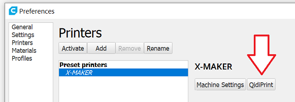

# Cura-QidiPrint Plugin

## Plugin for Cura 5.1 that allows monitoring and printing Qidi 3D printers over network 

## Installation via Cura Marketplace

Simply open Cura and go to the **Marketplace** in the menubar, search for the QidiPrint plugin and install it!

## Manual Installation

With Cura not running, unpack the zip file from the
[release](https://github.com/alkaes/QidiPrint/releases/latest) to this
specific folder:

  * Windows: `%USERPROFILE%\AppData\Roaming\cura\5.1\plugins\`
  * MacOS: `~/Library/Application Support/Cura/1.5/plugins/`
  * Linux: `/home/<username>/.local/share/cura/5.1/plugins/`

If you don't have Qidi printers available in Cura, unpack the [Qidi Printer Definitions.zip](https://github.com/alkaes/Qidi-Printer-Definitions/releases/download/1.0/Qidi-Printer-Definitions.v1.0.zip) to this specific folder:
  * Windows: `%USERPROFILE%\AppData\Roaming\cura\5.1\`
  * MacOS: `~/Library/Application Support/Cura/5.1/`
  * Linux: `/home/<username>/.local/share/cura/5.1/`

## Configuration

**Do NOT try to add a new "networked printer"!** This is only for Ultimaker printers.

**If you did not use printer definitions archive from above to add Qidi printer, in order for this plugin working properly, your printer.def.json must have "manufacturer" property set to "Qidi"**

QIDI printers are configured through the extension menu bar:

* Start Cura
* Inside the cura Prefernces->Printers selct and activate your printer
* Click "QidiPrint" button right to the Machine Settings button:

* A new window will pop-up with detected printers list (you also can add them manually by pressing the Add button)

* Choose your printer and press the "Connect" button
* Click "Close"
* Done!

Now you can load a model and slice it. Then look at the bottom right - there
should be the big blue button with you printer name on it!

## License

Thank you to Nick Kuvyrkin ([nkuvyrkin](https://github.com/nkuvyrkin)), [jvrobert](https://github.com/jvrobert) and [philltran](https://github.com/philltran) for working on Cura 5.x support.

This project is inspired and using code from:
* https://github.com/Kriechi/Cura-DuetRRFPlugin
* https://github.com/Jeredian/mks-wifi-plugin
* ChituCodeWriter.py is taken from https://github.com/Spanni26/ChituCodeWriter
